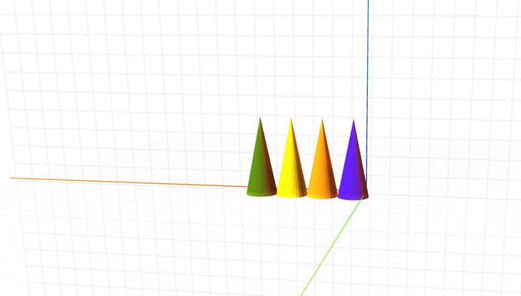

# craft-cone
Cone

## Install:

    $ npm install craft-cone

## Parameters:

**topRadius:** To adjust radius of the upper surface of cone

**baseRadius:** To adjust radius of the lower surface of cone

**height:** To adjust height of cone

## Example: 

```html
<craft>
    <craft name="cone" module="craft-cone"/>
    <cone topRadius="2" baseRadius="5"></cone>
    <cone topRadius="7" baseRadius="2"></cone>    
  	<cone topRadius="2" baseRadius="5" height="14"></cone>
    <cone ></cone>
</craft>
```



